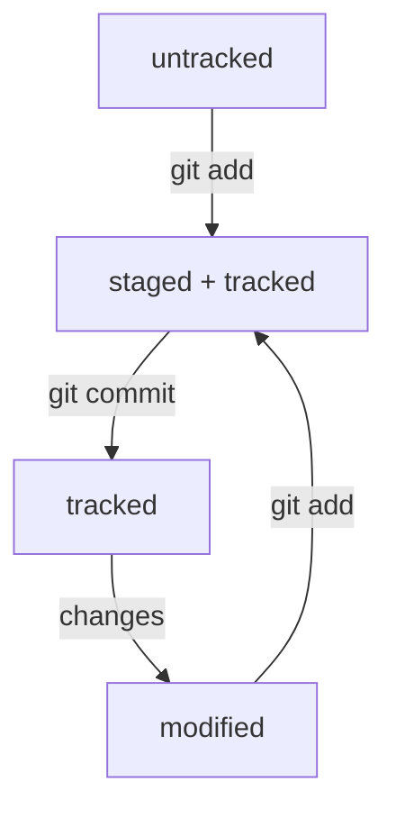

# Напоминалка-помощник по запулливанию проектов на GitHub

1. Создадим папку и перейдём в неё при помощи команд:  
```
mkdir helper
cd helper
```
2. "Загитим" папку командой:  
```
git init
```
3. Проверяем статус проекта командой:  
```
git status
```
4. Добавляем файлы в репозиторий и готовим их к сохранению с помощью команд:  
```
touch file.txt
git add file.txt
```
5. Коммитим при помощи команды:  
```
git commit -m 'commit text'
```
6. Создаём на [GitHub](https://www.github.com "GitHub") новый репозиторий *helper*  

7. Синхронизируем репозитории при помощи команд:  
```
git remote add origin git@github.com:aloha-joe/helper.git
git branch -M main
git push -u origin main
```

## Навигация и статусы

### Хеши

Хеш - основной идентификатор коммита. Посмотреть хеш коммита можно, воспользовавшись командой:  
```
git log
```
Все хеши, а также таблицу соответствий хеш → информация о коммите Git хранит в папке .git.  
Для получения сокращенного лога следует воспользоваться командой:  
```
git log --oneline
```
служебный файл HEAD указывает на коммит, который был сделан последним. Внутри него содержится ссылка на refs/heads/main или refs/heads/master, в котором и содержится хеш последнего коммита.  

### Статусы файлов

Статусы:  
untracked - неотслеживаемые файлы  
staged - подготовленные, находятся в списке файллов, которые попадут в коммит  
tracked - отслеживаемый. Файлы, которые уже были зафиксированы с помощью git commit  
modified - измененные файлы  

Типичный жизненный цикл файла в Git:  


